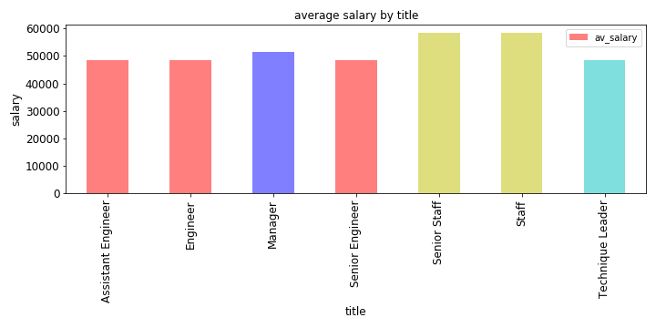

# EMPLOYEE DATABASE : A MYSTERY IN TWO PARTS
# TECHNICAL REPORT

## Data Modeling
ERD file has been created to show relationship between the six tables.The relationships are one to one, one to many,many to one and many to many.

### Data Engineering

The tables were made keeping in mind the primary and foreign keys.The .sql file has been saved as Data_Engineering.sql.The following steps/code were involved in data engineering

--Data engineering

--Drop table if exists

DROP TABLE IF EXISTS dept_emp;

DROP TABLE IF EXISTS dept_manager;

DROP TABLE IF EXISTS titles;

DROP TABLE IF EXISTS salaries;

DROP TABLE IF EXISTS departments;

DROP TABLE IF EXISTS employees;

-- Exported from QuickDBD: https://www.quickdatabasediagrams.com/
-- Link to schema: https://app.quickdatabasediagrams.com/#/d/8S0U21
-- NOTE! If you have used non-SQL datatypes in your design, you will have to change these here.

CREATE TABLE "departments" (
    "dept_no" VARCHAR   NOT NULL,
    "dept_name" VARCHAR   NOT NULL,
    CONSTRAINT "pk_departments" PRIMARY KEY (
        "dept_no"
     )
);

CREATE TABLE "dept_manager" (
    "dept_no" VARCHAR   NOT NULL,
    "emp_no" INTEGER   NOT NULL,
    "from_date" DATE   NOT NULL,
    "to_date" DATE   NOT NULL
);

CREATE TABLE "employees" (
    "emp_no" INTEGER   NOT NULL,
    "birth_date" DATE   NOT NULL,
    "first_name" VARCHAR   NOT NULL,
    "last_name" VARCHAR   NOT NULL,
    "gender" VARCHAR   NOT NULL,
    "hire_date" DATE   NOT NULL,
    CONSTRAINT "pk_employees" PRIMARY KEY (
        "emp_no"
     )
);

CREATE TABLE "salaries" (
    "emp_no" INTEGER   NOT NULL,
    "salary" VARCHAR   NOT NULL,
    "from_date" DATE   NOT NULL,
    "to_date" DATE   NOT NULL
);

CREATE TABLE "titles" (
    "emp_no" INTEGER   NOT NULL,
    "title" VARCHAR   NOT NULL,
    "from_date" DATE   NOT NULL,
    "to_date" DATE   NOT NULL
);

CREATE TABLE "dept_emp" (
    "emp_no" INTEGER   NOT NULL,
    "dept_no" VARCHAR   NOT NULL,
    "from_date" DATE   NOT NULL,
    "to_date" DATE   NOT NULL
);

ALTER TABLE "dept_manager" ADD CONSTRAINT "fk_dept_manager_dept_no" FOREIGN KEY("dept_no")
REFERENCES "departments" ("dept_no");

ALTER TABLE "salaries" ADD CONSTRAINT "fk_salaries_emp_no" FOREIGN KEY("emp_no")
REFERENCES "employees" ("emp_no");

ALTER TABLE "titles" ADD CONSTRAINT "fk_titles_emp_no" FOREIGN KEY("emp_no")
REFERENCES "employees" ("emp_no");

ALTER TABLE "dept_emp" ADD CONSTRAINT "fk_dept_emp_emp_no" FOREIGN KEY("emp_no")
REFERENCES "employees" ("emp_no");

ALTER TABLE "dept_emp" ADD CONSTRAINT "fk_dept_emp_dept_no" FOREIGN KEY("dept_no")
REFERENCES "departments" ("dept_no");

--Query all the tables

SELECT * FROM departments;

SELECT * FROM employees;

SELECT * FROM dept_emp;

SELECT * FROM salaries;

SELECT * FROM titles;

SELECT * FROM dept_manager;

#### Data Analysis
The query of the data has been done by joining diffeent tables.The code has been saved in the file 'Data_Analysis.sql'

##### Data Visualisation
The final step involves the visualisation of the data .The graph has been plotted here.

The titles 'Staff' and 'Senior Staff' get the highest salary.Also the salary of 'Staff' and 'Senior Staff' are equal.The engineer,assistant engineer and senior engineer get the same salary and also the lowest salary.
The data doesnot show the general trend of salary of employees in a company as it shows same salary at different levels.

